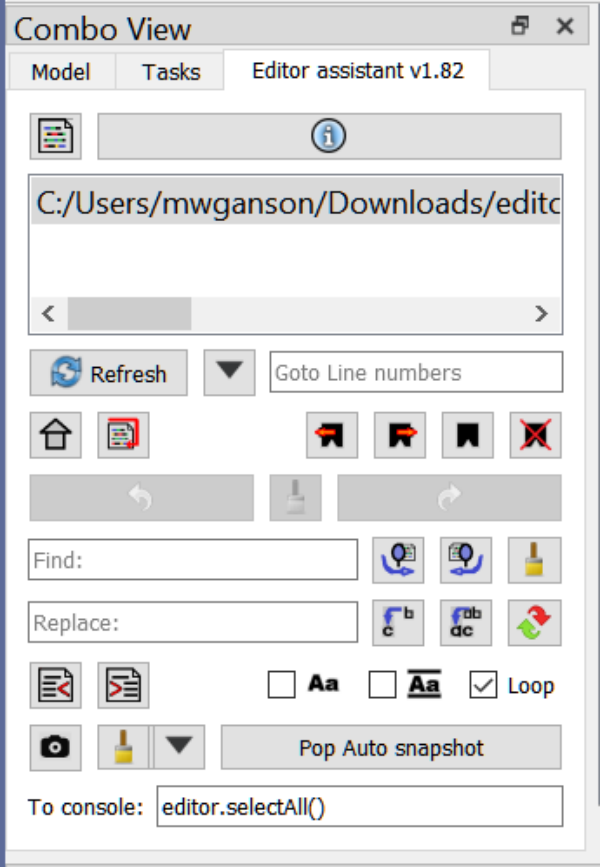

# Editor_Assistant
FreeCAD macro adds additional functionality to FreeCAD's built-in python editor.  It is not a replacement for the editor, but rather a supplemental toolkit for the editor.  It gives you functions like find and replace, diffing, snapshots, templates, bookmarks, and convenient links to help and documentation.

## Installation
Install via the Addon manager (soon).  Until then copy the .FCMacro file to your Macro folder.  The macro will create a new file called Editor_Assistant_Templates.txt in the same folder.  This file holds the templates.  It will need to be removed manually when you uninstall the macro.

## Toolbar icon
Download the toolbar icon: <a href="Editor_Assistant_Icon.svg"> Link</a> 

## Screenshot

## Usage
By default the macro opens in a 3rd tab in the combo view.  You will have Model, Task, and Editor assistant tabs.  If you prefer having a floating dockable, hold Alt key down while executing the macro.  

The title bar will show the current version: "Editor Assistant v1.09", for example.  The dialog works with the concept of a current editor, which will be one of the text documents currently open.  These can be python scripts or "Text document" objects.  Basically, any view in the MDI area that has a QPlainTextEdit as a child shows up in the macro's editor list at the top of the dialog.  The editor list will need to be refreshed from time to time when you open/close a document, using the "Refresh" button.  Ensure you are viewing the current editor by selecting it in the editor list at the top of the macro.

The widgets in the dialog are presented in a series of horizontal lines (using QHBoxLayouts).  Here I will discuss briefly each line and the widgets contained on each.

## Top line
The Top Line has the Main menu button and the Toast button.
### Main menu button
This button is at the top left of the dialog and has the main editor assistant icon.  Click the button to bring up the main menu, which contains the Close option to exit the macro.  (But it's not really necessary to close the macro, just switch to one of the other tabs.)  The main menu will be discussed in more detail below.
### Toast button
At the top of the dialog, above the Editor List there is a button reserved for "toast" messages.  These are transient messages that disappear automatically after a few seconds.  They can be error messages or just information.  The button serves as the label for the messages.  Click the button to see a log of previous messages in the Report view.  The color of the message indicates the type of message.  Types are: message: black, information: blue, error: red, warning: yellow.  For some types the background color of the toast button is temporarily changed to provide better contrast.
## Editor line
### Editor list
This is the QListWidget at the top of the dialog.  It will list the names of the documents currently registered with the dialog.  Select an item in the list to make make that item the current editor.  This also sets the focus on that editor.  All the actions in the dialog will work on that current editor even if you select a different editor in FreeCAD's MDI widget.  It is recommended to select the editor here so the dialog is in sync with the correct editor.  From time to time the list might need to be synchronized with the open editors when a file has been opened/closed/created.  Press Refresh to do this.
## Refresh line
### Refresh button
This button is labeled "Refresh".  Click it if you have opened a new document or closed a document, so the Editor List can be updated.  Updates also happen when other functions are used and when documents are opened, but not when closed.
### Goto menu button
This button is next to the refresh button and currently has a down arrow icon.  Click this button to bring up a menu of Goto options.  This is a very powerful and useful feature that can save you a lot of time.  The Goto menu is also incorporated into the main menu as a Goto submenu.  The Goto menu will be discussed in more detail below.  It provides quick access to find results, bookmarks, line number presets, and more.
#### Go to line numbers
This is a QLineEdit that can hold either a single number (the line number you wish to go to) or a (comma separated) list of numbers that will appear in a selection menu when press return/enter while the widget has keyboard focus.  The goto line option(s) appear as menu items in the Goto menu.
## Undo line
### Undo button
Important: Both undo and redo will replace all the text in the current editor with what it was when the undo/redo was stored in memory.  This overwrite any changes you made by, for example, typing directly into the editor.  As an example, suppose you rename some variable using replace all, from "myvar" to "myvariable".  This is staged in the undo queue as "Undo replace myvar".  Then you type in code for a new function definition.  After typing that in you decide you want to undo renaming myvar to myvarible because it's too much typing, so you click Undo rename myvar.  Guess what just happened to the new function definition?  It's a gone pecan (but is staged in Redo).  The editor has its own Undo/Redo system that does not always coincide with the macro's Undo/Redo queue.  Use the macro's Undo to undo things done in teh macro, such as replacing text or something done in the To console: edit.

Click to undo an operation.  Undo only works on things done in the dialog.  There is a maximum number of events that can be undone.  Currently, this is 100, but is subject to change.  This is set in the source code as UNDO_QUEUE_MAX_SIZE = 100, at the top of the source file.  This is to prevent potential out of memory errors.  The queue is based on the current editor.  As you switch editors (via the editor list) the Undo button label will change, and will sometimes become disabled if there are no undo events in the queue for that editor.
### Purge undo/redo queues
Clicking this button purges the undo/redo queues.  This cannot be undone.
### Redo button
When an operation is undone, the undone is popped and sent to the redo queue.
## Find line
### Find edit
This is a QLineEdit into which you may enter text to search for in the current editor.  As characters are typed you will see a new toast showing how many times the entered text can be found in the current editor.  If you are in "find" highlight mode you will also see matching text being highlighted in the current editor, if it is visible.  (The Match case checkbox and the Whole words checkbox both figure into this.)  You may press Enter/Return in this box to instigate a search or use one of the Find buttons.  For both the Find and Replace line edit widgets there is a context menu option to paste the currently selected text from the current editor into them.  This can also be done by double clicking the line edit.

The text in the Find edit can also be used to fill in replacement text when using templates, discussed in more detail below.
### Find next
Click this button to find the next instance of the text in the Find edit.  If a match is found the text will be selected in the current editor and the cursor will move to that line.  If it is not found, then nothing happens.  Ctrl+Click to search from the beginning of the document.  Alt+Click to find from selection.  This uses the text currently selected in the current editor as if it were in the Find edit widget.
### Find previous
Like Find next except it searches backward.  Ctrl+Click to begin the search from the end of the document.  Alt+Click to find from selection.  This uses the text currently selected in the current editor as if it were in the Find edit widget.
## Replace line
### Replace edit
This is a QLineEdit containing replacement text (replacing the text in the Find Edit) when the Replace or Replace All buttons are used.  The text in the Replace edit can also be used as replacement text when using templates, discussed in more detail below.
### Replace
Replace the currently selected text in the current editor with the text in the Replace Edit, and then toggle the Find next button.  Note: there need not be a previous find success.  Whatever is currently selected gets replaced.  You can use Undo to undo this operation.
### Replace all
Replace all occurrences of the text in the Find edit with the text in the Replace edit in the entire document.  Or Ctrl+Click to only replace the occurrences in the currently selected text.  If Replace edit is empty, then the occurrences are simply deleted.  This respects the Match case checkbox state.  It is incompatible with the Whole word checkbox checked state, and is therefore disabled when that checkbox is checked.  This can be undone using the Undo button.
## Match line
### Unindent
Moves the selected text in the current editor to the left by 4 spaces if there are 4 spaces in front of every selected line.  If not every selected line has 4 leading spaces the operation will not be done.
### Indent
Moves the selected text in the current editor to the right by 4 spaces.
### Match case
This is a QCheckBox.  If checked searches are case-sensitive.  Replace and Replace all both respect this checkbox state.
### Whole words
This is a QCheckBox.  If checked, then searches are for the entire word.  For example, "en" will not find "end" as a match if Whole words is checked.
### Loop
This is a QCheckBox.  If checked, then when there is a search that finds no result the cursor is set back to the top of the document.  Or if it is a backwards search then the cursor goes back to the end of the document.
## Snaps line
### Take snapshot
Takes a snapshot of the current editor, including it's full text and position of cursor if there is text selected.  Snapshots can be very useful as temporary, in-memory backups of the file currently open.  They can be used to restore the content back to the previous state, including the cursor position.  They can be used to create diffs to show the changes that have been made since the snapshot was taken.  (When a file is first opened an automatic snapshot is taken.)
There is a special menu devoted to snapshots and diffs, the Snaps menu, discussed in more detail below.

Snapshots can be taken, popped, restored, discarded, saved, loaded, edited, and diffed.  Popping a snapshot means to restore it to the current editor and then discard it.  Restoring is like popping except for 2 differences: the snapshot is not discarded, and snapshots may be restored in any order (not only the most recent).  Discarding is like popping except without restoring.  You may save the snapshot as a file with the .py or .FCMacro extension, or any other extension you prefer.  You can also save all the snapshots into a single file, stored in JSON format.  Snapshots may be loaded from the JSON file.  Editing a snapshot involved editing the "reason", which is a very brief description of the snapshot.  Diffing creates an html file showing the differences between the 2 compared things, typically the current editor with one of its snapshots.
### Discard latest snapshot
Discards most recent snapshot (without restoring it).  Use pop to restore and discard or restore from the menu if you don't want to discard.
### Snaps menu
This opens the Snaps menu, discussed in more detail below.
### Pop snap
This pops the latest snapshot in the queue, restoring it to the current document (overwriting its contents) and then discarding the snapshot.
## Console line
### To console
This line edit can be very useful for directly controlling the current QPlainTextEdit widget, referenced as variable "editor" from this widget.  For example, enter editor.selectAll() to select all the text in the current document.  Refer to Qt documentation for functions available to QPlainTextEdit widgets.

Another variable available is "dlg", which refers to the Editor assistant dialog itself.  This is mainly something I wanted as a debugging aid while writing this macro, but can have its uses.

Enter search("search string") to search FreeCAD source code on github in a new browser tab.

Enter qSearch("search string") to search qt for python documentation in a new browser tab.

Enter help("search string") for help on python.  For example, help("numpy") will bring up help documentation in a new text document on that package.  Another example, help("Part.makeShell") for help on the Part.makeShell() function.

Enter menu(Part.Circle)  (Notice no quotation marks.) to get an interactive menu related to all things Part.Circle.  Enter menu(Sketcher.Sketch) for an interactive menu on Sketcher.Sketch.

Use "\n" for multiple line commands.

Once a command has been entered you can then access "editor" and "dlg" via the python console.

## Menus
There are 3 menus: the main menu, the goto menu, and the snaps menu.  The goto and snaps menus are also accessible from the main menu.
### Main menu
The main menu is accessed by clicking the Main menu button at the top left of the dialog.
#### Settings menu
Here you can change some settings.  Currently, only layout is available, but more settings will be coming to this menu in the future.  Within layout you can individually enable/disable various lines of widgets.  This is so you can make the dialog smaller if you need to and if you don't need access to those widgets you are hiding.
#### Goto menu
Discussed in detail in its own section below.
#### Snaps menu
Discussed in detail in its own section below.
#### Templates menu
Templates are a way to insert text into the current document without needing to do so much typing.  They are also convenient because there is less need to refer to documentation for exact syntax, arguments available, etc.  In its simplest form a template merely inserts some text into the current cursor position.  A more advanced usage is to have replaceable text that is dynamically replaced during the insertion.

Templates are a dictionary of dictionaries.  The entire template set is a dictionary with the template names serving as keys.  The value for each key is a dictionary.  

This template item dictionary must have at least one key named "output".  The rest are all optional.  The value of this "output" key is the text to be inserted or one of these recognized tokens:

<pre>
"output" keywords:

"input" -- output text is typed into a multiline QInputDialog during template execution
"input1" -- same as input, but a single line edit dialog is used
"selection" -- output text is the text that is currently selected in the current editor
"clipboard" -- output text comes from the clipboard
Any other value is the output text.
</pre>

An optional key is "goto", which contains the line to go to before inserting the text.  The value can be a line number, such as "42".  It can also be "home" (move to beginning of document), "end" (move to end of document), or "input" (get the line from the user during template execution).  If there is no "goto" key, or if its value is "current" or "", then the text is inserted at the current cursor position.  Use "relative:NNN" for relative line changes.
<pre>
"goto" values:

"home" -- go to start of document
"end" -- go to end of document
"42" -- go to line 42 (or whatever)
"input" -- get the line number in a popup QInputDialog during template execution
"current" or "" -- use current cursor position
"relative:3" -- go 3 lines down from current cursor position
"relative:-7" -- go 7 lines up from current cursor position
</pre>

We have "output" and "goto" as recognized tokens for key names that have special meanings.  All other keys are treated as the text to be replaced in the "output" value.  For example, if the key is "label", then the string label is replaced with the value of this key during template execution.  You can see this at work with the default "button" template item.  The 2 keys "label" and "name" are replaced in the "output" value.
<pre>
Replacement key values:

"input" -- get input from user during template execution in a multiline text input dialog
"input1" -- same as input, but use a single line input dialog
"clipboard" -- use the text in the clipboard to replace this key in the "output" value text
"find" -- use the text from the Find edit
"replace" -- use the text from the Replace edit
"selection" -- use the text selected in the current editor
Any other value is used directly as the replacement text
</pre>
Template items are converted many times between string and dictionary using json.dumps() and json.loads().  These functions require very specific syntax.  The templates are stored in a file called "Editor_Assistant_Templates.txt" and may be edited with any text editor if you prefer that method over using the Template editor dialog.  This file is created and placed into the Macro folder, as a sibling to the macro.  Its name is based on the macro name, so if you rename the macro it also uses a different name for its templates file.  This can be a way to maintain separate template files, if preferred.  The file is created and managed automatically, but it must be manually deleted if you decide to uninstall the macro.

##### Insert from dialog
This brings up a QInputDialog.getItem() dialog from which you can select the desired template to execute.
##### Insert (submenu)
This does the same thing as Insert from dialog except you are presented with the templates directly as menu / submenu items, the goal being to make it a bit more streamlined.  Once the template is selected the procedure is the same for both here and using Insert from dialog.  Just use the one you prefer.
##### Edit templates
This brings up the Template editor dialog.  In that dialog you can create new templates, delete templates, edit their content, execute them, test them, execute to clipboard, and get some additional help text.
###### + button
This creates a new template that is a copy of the currently selected template, to be used as a starting point.
###### - button
This deletes the currently selected template.  If you delete the last template, a new default is created.  This is so there is always at least one template.  Deleting cannot be undone.  (But if you press the cancel button your templates file has not yet been changed at this point.  It only changes on clicking Apply or Ok.)
###### Rename button
This allows to rename a template.  You cannot have 2 templates with the same name.
###### Filter
The very top of the dialog features a filter section.  If the checkbox is checked, then the text in the filter edit (if any) is used to filter which templates are showing in the template list.  There is also a match case checkbox for case-sensitive filtering.  When filtering, only those template times that have the filter text in their names will be shown.
###### templateList (QListWidget)
This is the list of templates at the top of the dialog.  Select the template to work on and its text appears in the edit widget.  Changing templates causes the previous template's changes to be updated in editor memory, but not the templates file.  That file only gets updated when pressing Ok or Apply.  Press Cancel to close the dialog without changing the templates file (as long as you didn't already use Apply).
###### edit (QPlainTextEdit)
This widget is where you type in the template item definition.  Because it is a QPlainTextEdit the macro might from time to time mis-identify it as an open editor.  In such cases you will see FreeCAD 0.20 as the editor title.  You can ignore this for the time being, although some functions might work on it, such as find/replace, this is all quite by accident and not all dialog functions are guaranteed to work properly.
###### Test button
Use this button to test a template to see the output that it will produce when executed.  You will see the output presented in a QMessageBox.
###### Execute button
Use this to execute the selected template just as if it were applied from the Templates menu using Insert.  Use this if you have made a temporary change to the template item definition, but don't want to save it to the templates file.  Use execute, then Cancel when done.
###### Execute to clipboard button
This works like the Test button except the output gets copied to the system clipboard.  You can then paste it into your document.
###### Help button
Brings up a small information dialog showing some basic information about using templates.
###### Ok, Apply, Cancel buttons
These work as you would expect in standard dialogs.  Ok will apply the changes you have made to the templates file and close the dialog.  Apply does the same as Ok, but without closing the dialog.  Cancel closes the dialog without applying any changes (but doesn't undo any previously applied changes).
#### Help menu
The Help menu provides dynamic menus for help on various topics inside the Reference submenu.  There you have quick access to the various FreeCAD modules, such as Part, Draft, etc., to FreeCAD/App and FreeCADGui/Gui modules.  You have also have access to the various Qt/PySide modules.  When you click on the topic of interest the results of an interactive help() inquiry are placed into a new editor window.  This is a very powerful reference tool.  Experiment with it to get a better feel for how it works.

In addition to the reference submenu you can also search FreeCAD source code and Qt for python online documentation.

Note: the menu creation can also be done via the To console: line edit.  Type in menu("Part.Circle") to see an example.  Similarly, search("search string") searches FreeCAD source on github and qSearch("search string") searches Qt for Python documentation.

#### Highlight menu
Highlighting is changing the background color of some text in the current editor.  This is done for text that matches what is currently selected in the editor or what is in the Find edit.  The highlight command can be invoked from the Main menu or from the Find edit context menu.  Note: the text highlighting is automatically undone when the selection changes.

Highlighting does not change the text.  You can see this by doing taking a snapshot before highlighting, and then doing a diff to see there are no changes.  But the undo is still there in case you want to restore the cursor position.

There are 2 highlighting modes: "find" and "selection".  By default, the macro opens in "find" highlight mode.  If you select some text in the current editor, then invoke highlight from selection from the main menu, this puts you into "selection" mode.  When in "find" mode, every time you make a change to the text in the Find edit the highlighting gets updated.  When in "selection" mode this does not happen, not even when the selection changes.  (You can double click the Find edit to conveniently put the selected text into it.)

When changing the state of the Match case and Match whole words checkboxes, the highlighting gets updated automatically.

##### From selection
This uses the text currently selected in the current editor as the search text for the highlight process.  This can be useful where you have some text in the Find edit that you don't want to change, but you want to highlight occurrences of some text in the current editor.  It is recommended to use the Find edit where possible because then when you update the text in the Find edit the highlight changes automatically.  This doesn't happen when changing the selected text while in "selection" highlight mode.

##### From find
This uses the text in the Find edit as the search text for the highlight process.

#### Close
Closes the dialog and exits the macro.  If for some reason due to a bug you cannot get the Main menu to function you can also close the macro from the To console: edit or from the python console with dlg.close().

### Goto menu
The goto menu is where you can go to various places in the open document.  It can be a real time-saver for larger documents.
#### Line numbers
Here you will find dynamic menus created for each line (if any) listed in the Goto line numbers edit.  If only one line is entered, then you get the one line as a menu option.  If multiple lines are entered (comma-separated) you get a menu for each line number.  (Pressing enter in the Goto line numbers edit also brings up this dynamic menu generation.)
#### Class / def lines
This is a way to quickly jump to a particular function definition or class definition in your file.  It is sorted by class name, then function name, so all the functions in a class are grouped together.  This is a huge time-saver.  Get familiar with it.  Note: this is done with very simple methodology.  It does not always work perfectly.
#### Bookmarks
A bookmark can be created for each line of interest.  Creation is done by adding a comment to the line in the form of ##: comment, 2 pound symbols (#) and a colon (:) followed by a label/comment, which can be anything.  Without a comment/label the bookmark will be ignored.
#### Find results
If the Find edit contains text that can be found in the document, then for each line the text is found on there is a dynamic menu item.  There will be a few characters before and after the Find text added for context.
#### Find selection results
Just like Find results except it uses the text currently selected in the current document as the find text instead of taking it from the Find edit.  Just select some text in the document, then click this menu to find all its locations and jump to them.
#### Home and End buttons
Go to the top / bottom of the current document.
### Snaps menu
Snapshots provide a sort of simplified version control system.  When you take a snapshot of a file you get not only the full current text, but also the cursor position, including any selected text, if any.  When the snapshot is restored, then also the cursor position is restored along with the text.  Snapshots can also be diffed against the current editor.  (Note: diffs are only for viewing, not intended to use as patches.)
#### Take snapshot
Take a snapshot of the current editor.  The snapshot is stored in memory only, not to persistent storage.
#### Restore last snap
Restore the last snap taken of the current editor.  (There might be some more recently taken of other editors, but this only accesses those taken of the current editor/document.)  Options here are to restore to the current editor (overwriting any existing contents), to the clipboard, or to a new Text document object.
#### Restore any
This restores to the current editor any of the snapshots in memory regardless of which editor was current when the snapshot was taken.  It also allows access to snapshots other than the most recently taken one.
#### Save
You can save the the most recent snapshot taken of the current document as a single file with .py, .FCMacro, or any other extension you wish to use.  Or you can also save all the snapshots into a text file in JSON format.  Snapshots are stored in memory, not to persistent storage.  This Save option provides a way for this, so the snapshots can be used over multiple sessions.
#### Load
Load the previously saved JSON format file of snapshots.
#### Discard
Discarding a snapshot is to destroy it without restoring.  This differs from popping in that the snapshot is restored before discarding.
#### Diff current editor
Diff a snapshot against the current editor.  An auto snapshot is taken automatically when a file is first opened.  If you make changes to the file, you can use the Diff feature to inspect your changes.  It looks very much like the output you see with git diff.  I find this quite convenient when putting together the Changelogs for my various projects.  The diff may by saved to html and opened in a browser.  The Diff Saver class has a few options, including context and column widths, that are not transferred to the saved html file.

In addition to diffing against snapshots of the current editor, you can also diff against text held in the clipboard and against other open editors.
#### Edit reason
A "reason" is a short documentation for a snapshot.  By editing the reason you are editing this documentation.

## Changelog
### 1.79 (2022.04.04)
* speed up loading by not importing some things until needed when creating help -> reference menus for FreeCAD packages.
### 1.78 (2022.04.04)
* fix bug in highlighting where keys like "+" were being interpreted as re special characters
### 1.77 (2022.04.03)
* bookmark icons
### 1.76 (2022.04.03)
* add bookmark features
* add bookmark buttons to goto line
* make goto line shown by default
### 1.75 (2022.04.03)
* add filter to template editor
### 1.74 (2022.04.03)
* add to settings menu: Show all, Show defaults, Show minimal
### 1.73 (2022.04.03)
* add UndoQueueMaxSize to parameters, default = 100
* add BookmarkMarker to parameters, default = "##:"
* add MaxIconizedButtonWidth to parameters, default: 32 px
* add EditorListMinimumHeight to parameters, default: 32 px
### 1.72 (2022.04.03)
* add new combo boxes to settings -> layout menu, make hidden by default to keep dialog small
### 1.71 (2022.04.03)
* accept mario52 PR, put new combo boxes that remember recent Find and Replace texts
### 1.70 (2022.04.03)
* Check if QtNetwork is available, if not disable in help -> reference -> qt -> menu
### 1.69c (2022.04.02)
* bug fix: 'selection' mode was switching to 'find' mode without user invoking highlight by find
* performance fix: return from highlight() if txt to be highlighted is empty string
### 1.69b (2022.04.02)
* make lastHighlightMode = "find" by default so user gets highlighting when first entering anything into find edit
### 1.69 (2022.04.02)
* Support Match whole words with highlighting and replace all (already worked with replace next)
* Redo highlighting when find edit text changes
* Redo highlighting when match case or whole words checkbox state changes
### 1.68 (2022.04.02)
* Make highlight function respect state of match case checkbox
### 1.67 (2022.04.02)
* remove view modes since those can be found in FreeCAD Windows menu.
### 1.66 (2022.04.02)
* add support for 'relative:' token for 'goto' keys in templates
### 1.65 (2022.04.02)
* change highlighting from html to QtGui.QTextEdit.ExtraSelection class
* remove unHighlight since no longer needed (text automatically unhighlights with a new selection)
### 1.64 (2022.04.02)
* disable highlighting where text contains <, nbsp;, or font///style.
### 1.62b (2022.04.01)
* highlighting
### 1.61 (2022.04.01)
* use submenus for class/def lines, find results, and find from selection results in goto menu
### 1.60 (2022.04.01)
* Diff saver use table column headers instead of QLabels
### 1.59 (2022.03.31)
* "output" key in template item can have token values:
"input", "input1", "clipboard", "selection"
* other keys can have token values:
"input", "input1", "selection", "clipboard", "find" ,"replace"
### 1.58 (2022.03.31)
* bug fix with snap diff menu generation
### 1.57 (2022.03.31)
* do not convert \n to chr(10) when executing templates
* 'input' now uses multi line text input dialog
* 'input1' new token uses single line text input
* build dynamic menus for template insertion
* check if macro already running and exit if so rather than have multiple instances
### 1.56 (2022.03.31)
* minor changes to template editor
* + button duplicates current template
* create new default template if last one is deleted
### 1.55 (2002.03.30)
Template editor dialog improvements
* on deleting select the next item
* on renaming, offer current name as default
* on renaming, select same item
* on new item, don't allow empty name
* move apply button to standard dialog button box
* change label of execute to clipboard so all buttons line up vertically
### 1.54 (2022.03.30)
* make template editor dialog non-modal
### 1.53 (2022.03.30)
* Ctrl+Replace all button = replace only in selection (not in whole document)
### 1.52 (2022.03.30)
* Home/End buttons, default = not shown, enable in main menu -> settings -> layout -> GotoLine
* Add Home/End menu items to Goto menu
### 1.51c (2022.03.30)
* allow "\n" to be used in input dialogs when using templates
### 1.51b (2022.03.30)
* add "current" as optional value for "goto"
* update help documentation in template editor
### 1.51 (2022.03.30)
* add "goto" key token to templates
### 1.50 (2022.03.30)
* instead of saving templates in user parameters, create a new file called:
"Editor_Assistant_Templates.txt" in same folder as macro
* add execute to clipboard button in template editor
* add execute button in editor
* preformat help text
* preformat test text
* add apply button in editor
### 1.49 (2022.03.29)
* add template function
### 1.48 (2022.03.28)
* Add .FCMacro, .py, .txt to snapshot save as file type
### 1.47 (2022.03.28)
* add qSearch() to search qt for python online documentation
### 1.46 (2022.03.28)
* add search() to help menu: 3 ways to search 1) from find edit text, 2) from selected text, 3) ask for text in a new dialog
### 1.45 (2022.03.28)
* add search() function to To console: line edit (opens new browser tab to github repo search results page)
### 1.44 (2022.03.28)
* add menu() alias for dlg.makeReferenceMenu() in To console:
* better support module names as strings in help() and menu()
### 1.42 (2022.03.28)
* allow for multiple line statements in To console line edit
* allow for help("help string") in To console line edit
### 1.41 (2022.03.27)
* add help menu
### 1.40b (2022.03.26)
* bugfix --error when creating new empty document
### 1.40 (2022.03.26)
* put line numbers first for find results in goto menu
* put some context characters ahead of find results in goto menu
### 1.39b (2022.03.26)
* remove a debug message
### 1.39 (2022.03.26)
* Automatically take a snapshot of each file when it is first opened.
* add goto menu to main menu
* add snaps menu to main menu
* internally rename snaps menu from context menu to normal menu since it's no longer a context menu
* disconnect mdi area subWindowActivated signal on closing
### 1.38 (2022.03.26)
* move diffs to mdi area for a more seamless integration
* add low priority toast option -- such toasts do not overwrite existing toasts
### 1.37 (2022.03.26)
* add view mode to main menu 
  supported modes: tabbed, tiled, cascade 
### 1.36 (2022.03.25)
* refresh editor list when a new text file is opened
### 1.35b (2022.03.25)
* fix typo in window title
### 1.35 (2022.03.25)
* change default from floating dockable widget to embedded as a 3rd tab in combo view.
* fix bug where warning toasts were shown as normal messages
* add Close to main menu
### 1.34 (2022.03.25)
* add main menu button
* add settings -> layout menu to enable/disable individual lines of widgets
### 1.33 (2022.03.25)
* optimize diff performance
### 1.32 (2022.03.24)
* show log of all toasts when clicking toast button instead of just the last toast
* add restore last snap to restore any menu
* allow to diff current editor to any other open editor
* allow to diff current editor against clipboard text
* extend showDiff() to be able to make diffs of arbitrary text strings
* add labels to diff screen
### 1.31 (2022.03.24)
* add find selection results to goto menu
### 1.30 (2022.03.24)
* trim some labels -- rely on icon and tooltips
* after To console command check if text changed for creating undo
* on To console command open python console if not already open, set keyboard focus to it
### 1.29 (2022.03.24)
* add dlg variable to To console command
* add Loop checkbox
* Ctrl+Find to search from beginning
* Ctrl+Find previous to search from end
* Alt+Find / Find previous to search using selected text
### 1.28 (2022.03.24)
* fix failure to set current editor (causes some blinking)
### 1.27 (2022.03.23)
* add restore any functionality
* rename some buttons so pop, restore, discard always mean the same things
### 1.26 (2022.03.23)
* add reason editor
* check for tabs and warn if any are found
* remove some tabs from Gimp-generated XPM icon string
### 1.25 (2022.03.23)
* improve diff viewer
### 1.24 (2022.03.23)
* make diffs into html and show in a web browser view
### 1.23 (2022.03.22)
* improve tooltips for snaps menu button and goto menu button
* allow to pop individual snaps out of order
* add load/save to/from JSON files (all snaps for all editors)
* add snap diff functionality (diff text goes to new Text document object) 
### 1.22c (2022.03.22)
* improve cursor centering
* check macro hasn't been closed before attempting to clear toast
* warn that find results do not respect whole words checkbox
### 1.22b (2022.03.22)
* make Find results menu respect Match case checkbox
### 1.22 (2022.03.22)
* add find results to goto menu
### 1.21 (2022.03.22)
* add bookmark functionality
* put submenus in goto menu for line numbers, class/defs, and bookmarks
### 1.20 (2022.03.22)
* rearrange some icons
* add goto menu
* allow for multiple line numbers (comma separated list) in goto line edit
### 1.19 (2022.03.21)
* change from task panel to dockable widget (Hold Alt key while executing macro for old behavior.)
* rework some icons  
### 1.18b (2022.03.21)
* add error checking for when there are no open editors
### 1.18 (2022.03.21)
* add snapshot feature
* add text cursor positioning to snapshots and undo/redo
### 1.17 (2022.03.20)
* new icons for indent and unindent
* double click Find/Replace edits to replace existing content with selected text in current editor
### 1.16 (2022.03.20)
* add redo button
* add undo queue clear button
* rearrange widgets, putting goto on same line as refresh button
* add placeholder text to goto line edit
### 1.15 (2022.03.20)
* Use a button for toast messages instead of a label.  That way it can be clicked and the last toast reshown.
* Use message types instead of colors direction.  message types: warning, error, message, information
* Set background color for some message types to get a nice contrast.
* Set a maximum length for undo queue and pop the oldest when the max is reached.  This is to prevent out of memory issues potentially.
* UNDO_QUEUE_MAX_SIZE = 100 (subject to change)
### 1.14b (2022.03.19)
* avoid infinite loop if replace all is clicked without anything in the Find edit
### 1.14 (2022.03.19)
* implement Undo button
### 1.13 (2022.03.19)
* handle backslashed characters in Find edit, such as \t, \n
### 1.12b (2022.03.19)
* fix type in Replace all handler.
### 1.12 (2022.03.19)
* Disable Replace all if Whole words is checked.
### 1.11 (2022.03.19)
* Make Replace all respect Match case checkbox (but still not Whole words)
### 1.10 (2022.03.19)
* add icons to the dialog
### 1.09c (2022.03.19)
* new icon
### 1.09b (2022.03.19)
* remove icon, to be replaced
### 1.09 (2022.03.19)
* embed xpm icon

